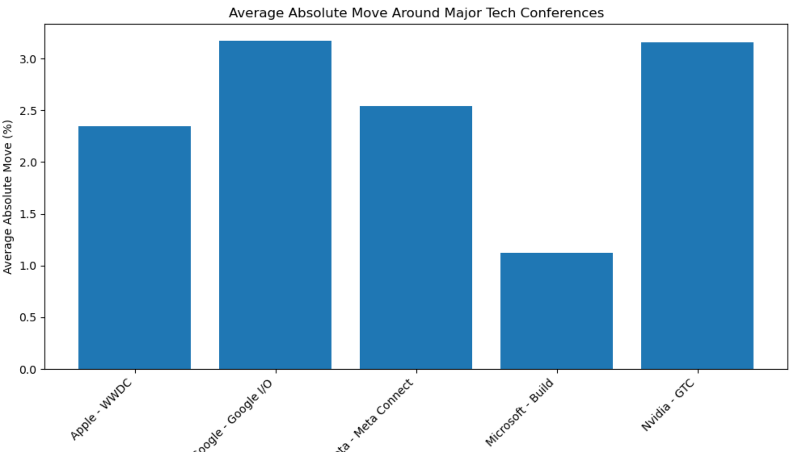
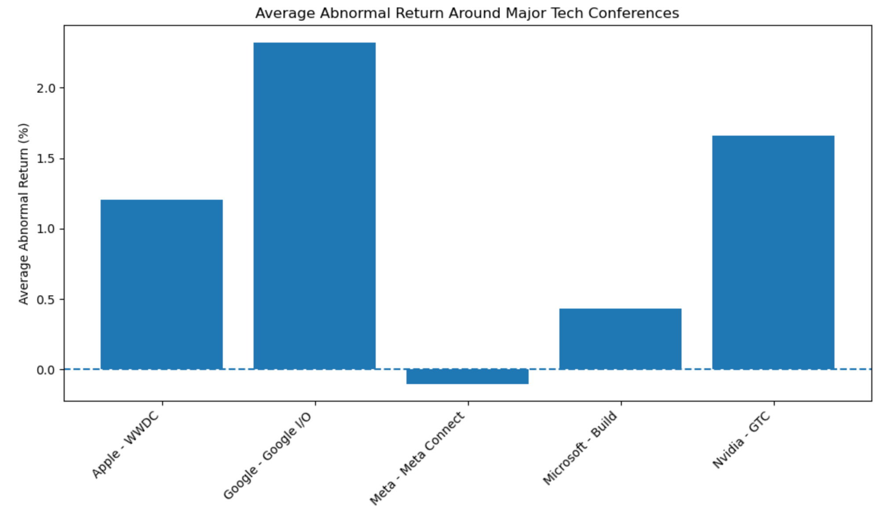
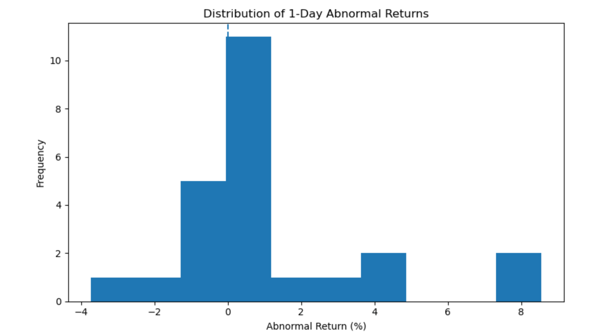
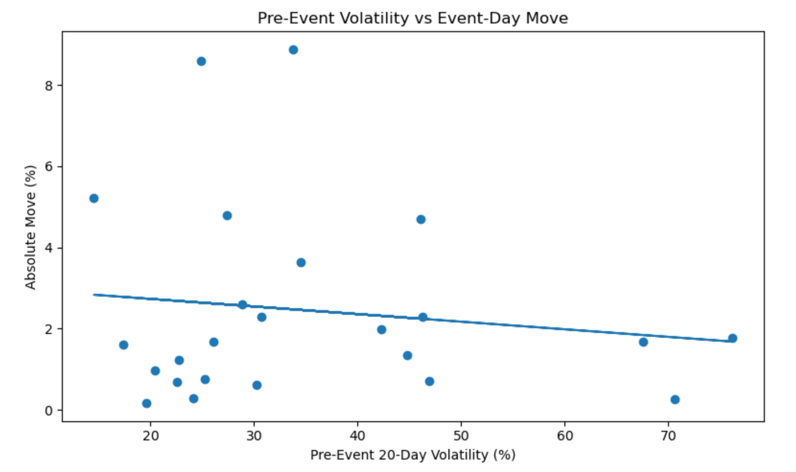
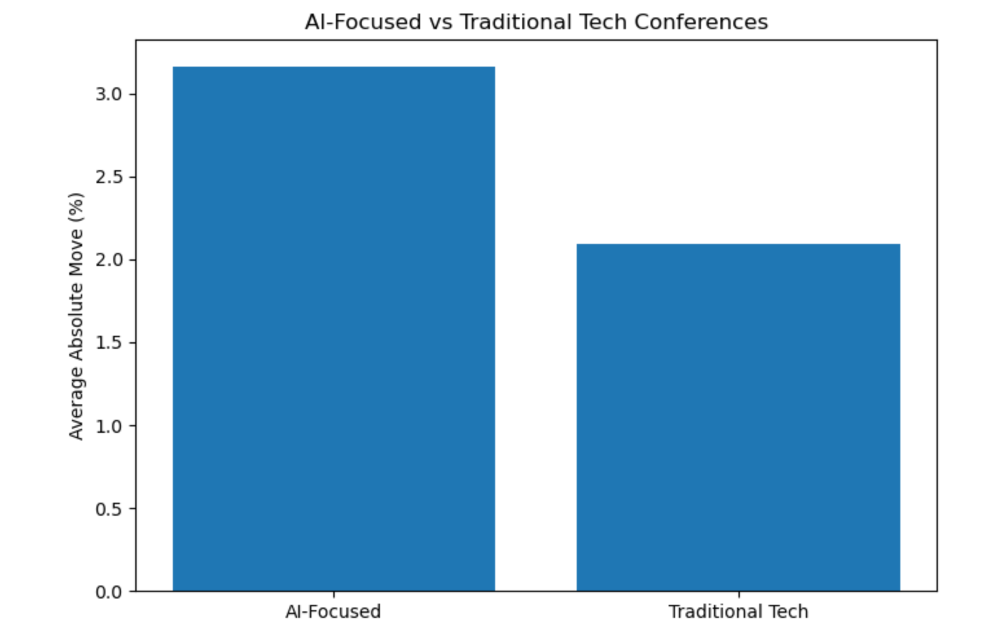

# Technology Conference Event Study

## Overview

This project investigates how equity markets react to major technology conferences using an event-study framework.

The study analyzes stock price reactions surrounding:

- Apple WWDC
- Nvidia GTC
- Google I/O
- Meta Connect
- Microsoft Build

The objective is to determine whether these conferences generate abnormal returns, increased volatility, and statistically significant market reactions.

---

## Research Questions

1. Do major technology conferences generate abnormal stock returns?
2. Which conference produces the strongest market reaction?
3. Do AI-focused conferences outperform traditional technology conferences?
4. Does pre-event volatility predict event-day price movements?

---

## Methodology

### Event Study

For each conference event:

- Calculate stock return on the event date
- Calculate market return using SPY
- Compute abnormal return

AR = Stock Return − Market Return

### Cumulative Abnormal Return (CAR)

Measure total abnormal performance over a 3-day event window.

### Volatility Analysis

- 20-day pre-event volatility
- 20-day post-event volatility
- Volatility change around events

### Statistical Analysis

- Mean
- Standard Deviation
- Skewness
- Kurtosis
- One-sample t-tests
- Correlation analysis
- Linear regression

---

## Dataset

Historical daily stock prices were downloaded using:

- yfinance
- Apple (AAPL)
- Nvidia (NVDA)
- Google (GOOGL)
- Meta (META)
- Microsoft (MSFT)
- SPY benchmark

Sample period: 2018–2025

---

## Key Findings

### Average Abnormal Return Ranking

| Conference | Avg Abnormal Return (%) |
|------------|-------------------------|
| Google I/O | 2.32 |
| Nvidia GTC | 1.67 |
| Apple WWDC | 1.21 |
| Microsoft Build | 0.43 |
| Meta Connect | -0.10 |

### Average Event-Day Move Ranking

| Conference | Avg Absolute Move (%) |
|------------|----------------------|
| Google I/O | 3.17 |
| Nvidia GTC | 3.15 |
| Meta Connect | 2.54 |
| Apple WWDC | 2.35 |
| Microsoft Build | 1.13 |

### AI vs Traditional Conferences

AI-focused events generated:

- Higher abnormal returns
- Higher cumulative abnormal returns
- Larger stock price reactions

compared to traditional technology conferences.

### Volatility Findings

Pre-event volatility showed little predictive power for event-day stock movements.

R² = 0.017

---

## Visualizations

### Average Event-Day Move

### Average Abnormal Return

### Distribution of Abnormal Returns

### Volatility vs Event-Day Move

### AI vs Traditional Technology Events

---

## Technologies Used

- Python
- Pandas
- NumPy
- SciPy
- Matplotlib
- yFinance
- Jupyter Notebook

---

## Future Improvements

- CAPM-adjusted abnormal returns
- Market-model event studies
- Options implied volatility analysis
- Intraday event windows
- NLP sentiment analysis of conference transcripts
- Larger event universe

